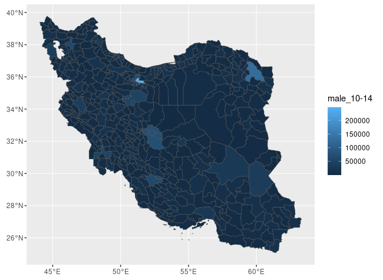

# Iran population data
Population of Iran according to the 2016 National Population and Housing Census by 
  - county (429 counties in 31 provinces), 
  - gender (male and female) and 
  - age group (five-year age groups)
  
  Source: [Statistical Centre of Iran](https://www.amar.org.ir/english)

## Getting the data
Download the [iran2016census.csv](https://github.com/jalilian/iran2016census/raw/main/iran2016census.csv) file or read it directly to `R` with
```
ir2016pop <- read.csv("https://github.com/jalilian/iran2016census/raw/main/iran2016census.csv")
by(ir2016pop$female, ir2016pop$age_group, sum)
```
## Getting maps
Download the shapefile (.shp) from the `shapefile` directory or use the following commands in `R`
```
library("sf")
ir2016sf <- readRDS(url("https://github.com/jalilian/iran2016census/raw/main/iran2016census.rds", "rb"))
library("ggplot2")
ggplot(ir2016sf) + geom_sf(aes(fill=`male_10-14`))
```

